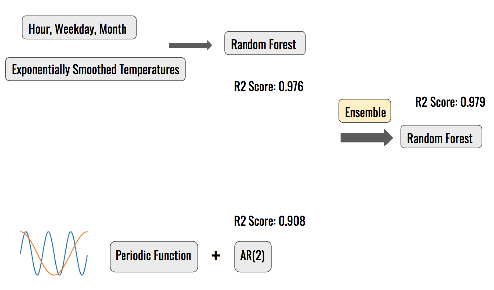
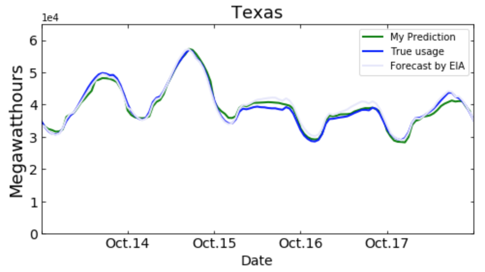
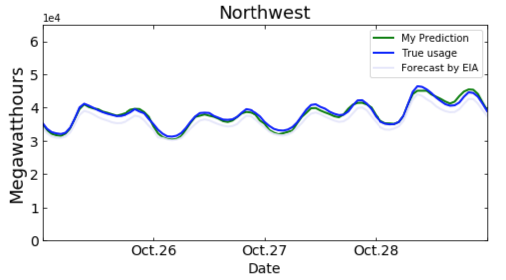

# Electricity Demand Prediction
**Minjie Lu**

## 1. Objective
The prediction can be used by the electricity authorities to make better resource schedule, for example, to decide whether to turn on a large plant. Better schedule can avoid the waste caused by long range transmission, more importantly, avoid large scale power outage when the demand becomes much higher than the supply.

## 2. Data
The hourly electricity operation data are obtained through the API provided by the Energy Information Administration (EIA) website.

```
http://api.eia.gov/series/?api_key={}&series_id={}&start={}&end={}
```
By specifying the API key, series id, start date and end date, the desired time series within the time range can be downloaded. Series id "EBA.TEX-ALL.NG.HL" stands for net generations of Texas. "TEX" can be replaced by the names of other regions. "NG" can be replaced by "D" for demands.

Historic weather data are obtained through the [National Centers for Environmental Information (NOAA) website](https://www.ncdc.noaa.gov/cdo-web/datatools/lcd). To get historic data for a weather station, a request needs to be submitted.

Weather forecast data are scraped either from the [NOAA website](https://forecast.weather.gov/MapClick.php?lat=29.77&lon=-95.39#.XcnsepJKhTY) or [weather.com](https://weather.com/weather/hourbyhour/l/110a124808308e4fc03ee2b75754a7e06e9334b6d23d6fa317f1bb84b5f8a65e)

## 3. Methods



### a. XGBoost
**Features:**

Time features: 24 hours, Weekday, Month. These features can decide whether lights are on, factories are running.

Exponentially smoothed temperatures: This is motivated from the fact that electricity demands are smooth but temperatures can fluctuate suddenly.

**Post-hoc correction:**

As population or industrial structure change every year, electricity demands change as well. It's problematic to train a model using the data of three preceding years. However, coincidently, the raw output of the XGBoost model can be linearly transferred to provide a perfect prediction.

### b. Time Series model

The time series model has three components: 1. A linear increasing trend. 2. A periodic model (Periods and harmonics: year, year/2, year/3, week, week/2, day, day/2, day/3, day/4). 3. An AR(2) model (Determined by the partial autocorrelation of the residual).

### c. Ensemble

The XGBoost model and the time series model are assembled by a random forest. Except for the prediction given by the two models, other features are: 24 hours, month, weekday, demand yesterday, demand the day before yesterday, difference between the two demands, temperatures yesterday, temperatures the day before yesterday, difference between the two temperatures, difference between the predictions given by the XGBoost and the time series model.

## 4. Results and Visualization

The following graphs are predictions using weather forecast data.

 

It can be seen that my model is comparable to the prediction given by the EIA for Texas and better for Northwest.

And here is a demo video .

And here is an interactive visualization panel on Heroku. It displays: 1. demands and predictions, 2. R2 score of last week to monitor prediction reliability, 3. peak demand change, 4. boxplots of tomorrow's and today's temperatures for reference.
